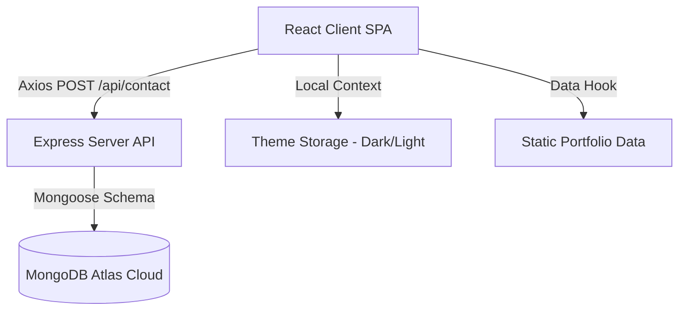
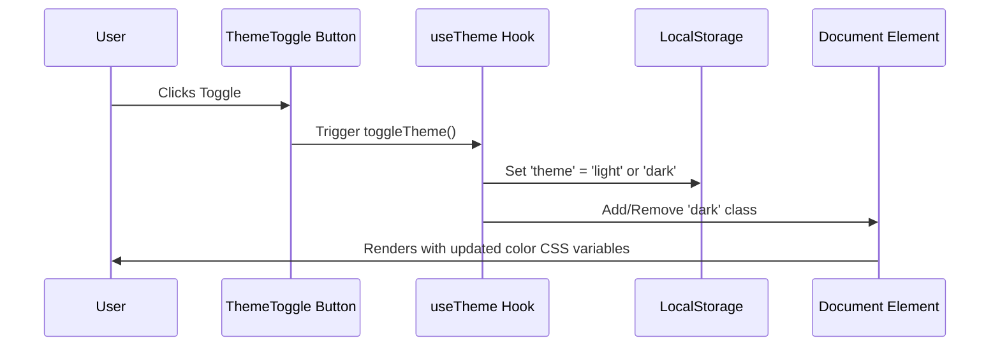

# Portfolio Project Architectural Flow

This document details the software architecture, visual design integration, data models, state layers, and routing sequences of the MERN stack portfolio.

---

## 🗺️ System Overview

The portfolio is structured as a decoupled full-stack application:
1. **Frontend (React client)**: A single-page application (SPA) using Vite, styled with Tailwind CSS, and animated using Framer Motion. Uses Axios for data transport.
2. **Backend (Express server)**: A REST API that handles contact form submissions, validates user inputs, and interfaces with MongoDB Atlas for persistent storage.

---

## 🎨 Theme State Flow

The application features a responsive theme manager that toggles between dark mode and light mode, persisting the selection across browser sessions.

---

## 📬 Contact Form Flow

When a user submits a message via the Contact Form on the Home page, the following sequence occurs:

1. **Client-Side Validation**:
   - The form checks if the required fields (`name`, `email`, `message`) are non-empty.
   - The email field is validated against standard email regex format.
   - While submitting, the submit button transitions into a loading spinner and is disabled to prevent multiple submissions.

2. **Network Request**:
   - A POST request is sent to `VITE_API_URL/contact` with the payload: `{ name, email, subject, message }`.

3. **Backend Processing**:
   - Express server intercepts the post on the `/api/contact` route.
   - The payload is mapped to the `Message` Mongoose Schema.
   - The model validates the fields. If invalid, the backend replies with a `400 Bad Request` and descriptive error message.

4. **Data Persistence**:
   - The message is written to MongoDB Atlas.
   - On success, the backend replies with `201 Created` status code and `{ success: true, message: "..." }`.

5. **Client Response Render**:
   - Axios resolves, the loading spinner is cleared, the form input states are reset, and a green success banner is shown with a slide-in micro-animation.

---

## 🗄️ Database Schemas

### Message Model
Defined in `server/models/Message.js`:
- `name` (String, required, trimmed)
- `email` (String, required, trimmed, lowercased, validated by regex)
- `subject` (String, optional, default "No Subject")
- `message` (String, required)
- `createdAt` (Date, automatically set to `Date.now`)

---

## 📍 API Route Map

All server endpoints are prefixed with `/api`.

| HTTP Method | Route | Description | Controller Action |
|---|---|---|---|
| **POST** | `/api/contact` | Submits a contact message | `contactController.submitMessage` |
| **GET** | `/api/health` | Verifies server and DB health | Custom route |

---

## 📂 Static Data Layouts (Frontend)

To support future integration of a Headless CMS or backend API for site content, data is centralized in static ES modules on the frontend:
- `client/src/data/projects.js`: Holds arrays of project specifications (id, title, categories, tags, images, links).
- `client/src/data/skills.js`: Holds skill names, categories (Frontend, Backend, etc.), and competence level percentages.
- `client/src/data/timeline.js`: Defines timeline data for education and work experiences.
