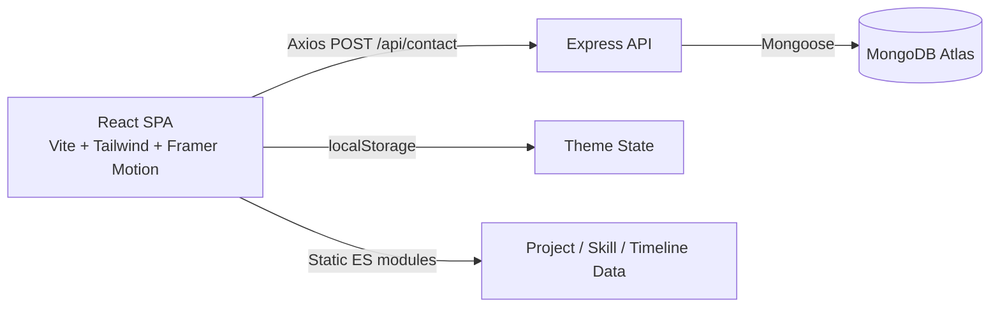

<div align="center">

# ✨ Harsh Portfolio

### Premium Glassmorphic MERN Stack Portfolio

A high-performance, full-stack developer portfolio featuring a glassmorphic UI, dynamic project showcase, and a working contact form backed by a real API.

[](https://harsh-portfolio-nu-inky.vercel.app)
[](https://react.dev/)
[](https://nodejs.org/)
[](https://www.mongodb.com/atlas)
[](https://tailwindcss.com/)
[](https://www.framer.com/motion/)

**[🔗 Live Site](https://harsh-portfolio-nu-inky.vercel.app)**

</div>

---

## 📌 About

This isn't a static template — it's a full MERN application. The **contact form actually persists to a real database** through a validated Express API, rather than faking a submit with a mailto link, and every project is rendered from a filterable, searchable data layer rather than hardcoded HTML.

---

## ✨ Features

- 🎨 **Glassmorphic design system** — deep-space color tokens, neon gradients, curated typography
- 🌗 **Dark/Light theme toggle** — persisted across sessions via `localStorage`, applied instantly with no flash
- 🔍 **Interactive project showcase** — filter by tech stack, search, and view full details in modal overlays
- 🎓 **Education & experience timeline** — interactive milestone tracker
- 📬 **Full-stack contact form** — client-side validation → Express API → MongoDB Atlas persistence, with a `201`/`400` response contract and animated success/error states
- 🔎 **SEO-optimized** — per-page titles and meta descriptions via `react-helmet-async`
- ⚡ **Smooth micro-interactions** — route transitions and UI animation via Framer Motion

---

## 🏗️ Architecture



**Contact form flow:**
1. Client-side validation (required fields + email regex)
2. `POST /api/contact` with `{ name, email, subject, message }`
3. Express validates against the `Message` Mongoose schema
4. On success → `201 Created`, message persisted to MongoDB Atlas; on failure → `400` with a descriptive error
5. UI clears the form and shows an animated success/error banner

---

## 🛠️ Tech Stack

| Layer | Technology |
|---|---|
| Frontend | React (Vite), Tailwind CSS, Framer Motion, React Router DOM |
| HTTP | Axios |
| Icons | Lucide React |
| SEO | react-helmet-async |
| Backend | Node.js, Express |
| Database | MongoDB Atlas + Mongoose |
| Security/Config | CORS, dotenv |
| Deployment | Vercel |

---

## 📁 Project Structure

```
HarshPortfolio/
├── client/                 # React frontend
│   ├── src/
│   │   ├── components/     # Navbar, Footer, ProjectCard, etc.
│   │   ├── data/            # projects.js, skills.js, timeline.js
│   │   ├── hooks/            # useTheme
│   │   ├── layouts/          # Layout wrappers
│   │   ├── pages/             # Home, Projects, About
│   │   └── services/           # api.js (Axios wrapper)
│   └── vite.config.js
│
├── server/                 # Express backend
│   ├── config/              # DB connection
│   ├── controllers/          # contactController
│   ├── models/                 # Message.js (Mongoose schema)
│   ├── routes/                  # /api/contact, /api/health
│   └── server.js
│
└── PROJECT_FLOW.md         # Full architecture & data-flow spec
```

---

## 📍 API Reference

| Method | Route | Description |
|---|---|---|
| `POST` | `/api/contact` | Submit a contact message (`name`, `email`, `subject`, `message`) |
| `GET` | `/api/health` | Server & DB health check |

**Message schema** (`server/models/Message.js`): `name`, `email` (validated, lowercased), `subject` (optional), `message`, `createdAt`.

---

## 🚀 Getting Started

**Prerequisites:** Node.js v18+, a MongoDB Atlas connection string

**1. Clone**
```bash
git clone https://github.com/Harsh-Kumar-Pandit/HarshPortfolio.git
cd HarshPortfolio
```

**2. Backend**
```bash
cd server
npm install
cp .env.example .env
```
Edit `.env`:
```env
PORT=5000
MONGODB_URI=your_mongodb_atlas_connection_string
NODE_ENV=development
```
```bash
npm run dev
```

**3. Frontend**
```bash
cd client
npm install
npm run dev
```

Frontend runs on `http://localhost:5173`, API on `http://localhost:5000`.

**Production build:**
```bash
cd client && npm run build   # outputs to dist/
```

---

## 👤 Author

**Harsh Kumar Pandit**
[GitHub](https://github.com/Harsh-Kumar-Pandit) · [Live Portfolio](https://harsh-portfolio-nu-inky.vercel.app)
